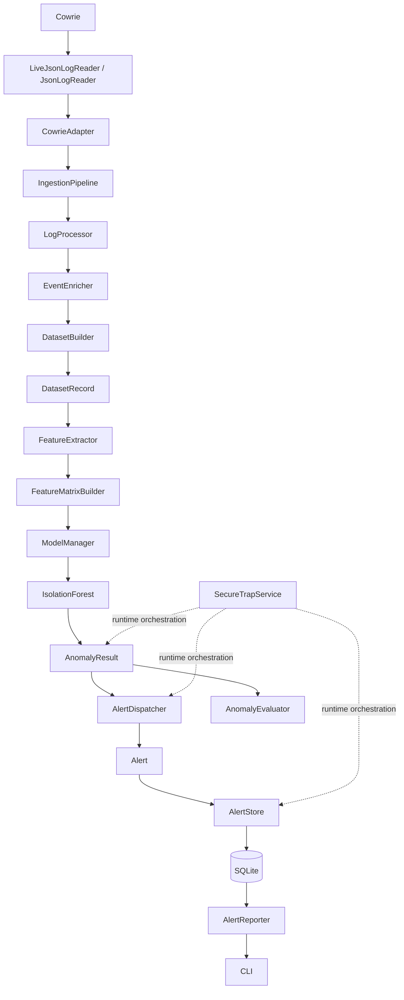

# SecureTrap

**SecureTrap** is a modular cybersecurity research framework for collecting, processing, analyzing, and monitoring honeypot activity.

The current implementation uses **Cowrie** as the active honeypot and **IsolationForest** for unsupervised anomaly detection. The system ingests events, validates and enriches them, builds structured records, detects anomalies, generates alerts, stores them in SQLite, and provides read-only operator visibility through a CLI.

> **Important:** SecureTrap currently has no verified ground-truth attack-label dataset. An anomaly is not a confirmed attack, and the current runtime does not perform supervised attack/benign classification.

## 🚀 Features

- 🐝 Cowrie honeypot integration
- 📥 Batch and live JSON log ingestion
- ✅ Event validation and normalization
- 🔎 Observable command enrichment
- 📊 Structured dataset generation
- 🧮 Deterministic feature extraction
- 🤖 IsolationForest anomaly detection
- 🔒 Explicit fit/inference lifecycle
- 🚨 Structured alert generation
- 💾 SQLite alert persistence
- 📋 Read-only alert reporting
- 💻 Operator CLI
- 🧪 Extensive automated tests
- 🔌 Honeypot-independent downstream architecture

## 🏗️ Architecture



## 🔄 End-to-End Workflow

1. **Ingestion** — `JsonLogReader` handles existing JSON/JSONL data; `LiveJsonLogReader` follows newly appended Cowrie log events.
2. **Adaptation** — `CowrieAdapter` converts Cowrie-specific data into the standard `AttackEvent`.
3. **Validation** — `IngestionPipeline` validates events before downstream processing.
4. **Processing** — `LogProcessor` adds deterministic category, severity, and normalized command information.
5. **Enrichment** — `EventEnricher` derives observable command features such as command length, URL-like content, IP-like content, file-path-like content, and shell metacharacters.
6. **Dataset** — `DatasetBuilder` produces stable `DatasetRecord` objects; `DatasetWriter` and `DatasetManager` provide dataset handling.
7. **Features** — `FeatureExtractor` and `FeatureMatrixBuilder` convert records into deterministic numeric model input.
8. **Detection** — `ModelManager` fits an `IsolationForest` baseline and reuses it for later inference.
9. **Results** — `AnomalyResult` preserves the model output and the source `DatasetRecord`.
10. **Alerting** — `AlertDispatcher` converts only anomalous results into `Alert` objects.
11. **Persistence** — `AlertStore` stores alerts in SQLite.
12. **Reporting** — `AlertReporter` reads stored alerts and the CLI presents them to the operator.

## 🤖 Machine Learning

### Model

```text
sklearn.ensemble.IsolationForest
```

SecureTrap uses IsolationForest for **unsupervised anomaly detection** because the current project does not have verified ground-truth attack labels.

The system intentionally does not fabricate supervised labels or security verdicts.

### Features

The current feature vector is:

```text
command_length
has_command
has_url
has_ip_address
has_file_path
has_shell_metacharacters
```

Feature order is fixed and deterministic.

### Prediction Semantics

IsolationForest output is preserved exactly:

```text
 1  = inlier / normal
-1  = outlier / anomaly
```

> `prediction = -1` means the model considered the observation an outlier relative to its fitted baseline. It does **not** prove that an attack occurred.

Likewise, `prediction = 1` does not prove that an event was benign.

### Model Lifecycle

```text
Historical baseline
      ↓
ModelManager.fit()
      ↓
IsolationForest
      ↓
ModelManager.predict()
      ↓
New AnomalyResult
```

The model is fitted once and is not automatically retrained on live traffic.

## 🚨 Alert Engine

### Alert

`AlertBuilder` converts an `AnomalyResult` into an operator-friendly `Alert`.

Stored alert information includes:

```text
timestamp
source_ip
session_id
protocol
honeypot
event_type
command
prediction
score
is_anomaly
```

### AlertDispatcher

Only `is_anomaly=True` results are dispatched as runtime alerts. Normal results do not become alerts.

### AlertStore

`AlertStore` uses Python's standard-library `sqlite3` for local persistence.

Default runtime database:

```text
data/securetrap_live_alerts.db
```

## ⚙️ Runtime

`LiveDetectionPipeline` connects validated live events to the fitted model.

`SecureTrapService` coordinates:

```text
LiveDetectionPipeline
        ↓
AlertDispatcher
        ↓
AlertStore
```

The service does not retrain the model or duplicate anomaly-filtering logic.

## 📋 Reporting & CLI

`AlertReporter` provides read-only summaries and recent-alert queries.

### Summary

```bash
python -m core.cli.main summary
```

Example:

```text
Total alerts: 1
Anomaly alerts: 1
Normal alerts: 0
Latest timestamp: 2026-08-30T11:42:08.966247Z
```

### Recent alerts

```bash
python -m core.cli.main alerts
```

### Limit results

```bash
python -m core.cli.main alerts --limit 5
```

### Custom database

```bash
python -m core.cli.main summary --db path/to/alerts.db
python -m core.cli.main alerts --db path/to/alerts.db --limit 10
```

The CLI is read-only and delegates querying to `AlertReporter`.

## 📊 Evaluation

`AnomalyEvaluator` reports descriptive statistics:

```text
total_count
normal_count
anomaly_count
anomaly_rate
min_score
max_score
mean_score
```

The current project does not claim accuracy, precision, recall, F1-score, or ROC-AUC because verified ground-truth labels are unavailable.

## ✅ Real-Time Verification

SecureTrap has been tested against a real Cowrie deployment.

A live command:

```text
echo http://1.2.3.4
```

produced:

```text
prediction = -1
score ≈ -0.2116
is_anomaly = True
```

The anomaly was converted into an alert, persisted into SQLite, retrieved through `AlertReporter`, and displayed through the CLI.

This verifies the end-to-end prototype flow; it is not a claim of supervised detection accuracy.

## 🧪 Testing

Run the complete test suite:

```bash
python -m pytest tests/ -v
```

The current verified regression suite contains **359 passing tests**.

Coverage includes:

- Event Engine and validation
- Honeypot adaptation and ingestion
- Log processing and enrichment
- Dataset management
- Feature extraction and matrices
- IsolationForest detection
- Model lifecycle and inference
- Anomaly evaluation
- Live detection
- Alert generation and dispatch
- SQLite persistence
- Runtime service orchestration
- Reporting
- CLI behavior

## 📁 Repository Structure

```text
SecureTrap/
├── core/
│   ├── event_engine/
│   ├── honeypot_engine/
│   ├── log_processor/
│   ├── dataset_manager/
│   ├── ai_engine/
│   ├── alert_engine/
│   ├── runtime/
│   └── cli/
├── tests/
├── legacy/
│   ├── train_model.py
│   ├── ai_predict.py
│   └── live_ai.py
├── data/
├── dataset.csv
├── test_logs.json
├── README.md
└── .gitignore
```

## 🕰️ Legacy Implementation

The original prototype used supervised command classification:

```text
dataset.csv
    ↓
CountVectorizer
    ↓
MultinomialNB
```

Those historical scripts are preserved under `legacy/` and are not part of the current runtime.

The current implementation instead uses deterministic features and `IsolationForest`-based unsupervised anomaly detection.

The two approaches are not interchangeable, and no performance comparison is currently claimed.

## ⚠️ Current Limitations

- No verified ground-truth attack dataset
- No supervised attack/benign classifier in the current runtime
- Small deterministic feature set
- No categorical/identifier encoding in the current feature matrix
- No online model retraining
- No trained-model persistence/versioning
- Local SQLite storage is intended for the prototype
- No external notifications
- No web dashboard
- No automated threat-intelligence enrichment

## 🔮 Future Enhancements

- Verified ground-truth dataset
- Supervised evaluation when reliable labels exist
- Additional honeypot adapters such as Dionaea
- Session-level and temporal features
- Additional observable command features
- Explicit categorical encoding strategies
- Model persistence and versioning
- Email, Slack, or webhook notifications
- Web dashboard
- SIEM integration
- Threat-intelligence enrichment

## 🔐 Security Notes

SecureTrap is intended for controlled cybersecurity research, experimentation, and educational environments.

An anomaly is not automatically a security incident. Operators should review the source IP, session, command, timestamp, event type, score, and surrounding session context before making a security decision.

## 👨‍💻 Development Approach

```text
Design
   ↓
Implementation
   ↓
Unit Tests
   ↓
Integration Tests
   ↓
Real-System Verification
   ↓
Git Checkpoint
```

The project emphasizes clear separation between data collection, processing, feature extraction, model inference, alert generation, persistence, reporting, and operator interaction.

## 📄 Disclaimer

SecureTrap is developed for cybersecurity research, experimentation, and educational purposes.

The current anomaly detector identifies observations that are unusual relative to its fitted baseline. It does not by itself establish that malicious activity occurred.

Human investigation and contextual analysis are required before treating an anomaly as a confirmed security incident.

## 👤 Author

**Guduru Jagadeeshwar Reddy**

Cybersecurity Department
Dayananda Sagar University, Bangalore

---

**SecureTrap — Honeypot-driven cybersecurity monitoring with unsupervised anomaly detection.**
